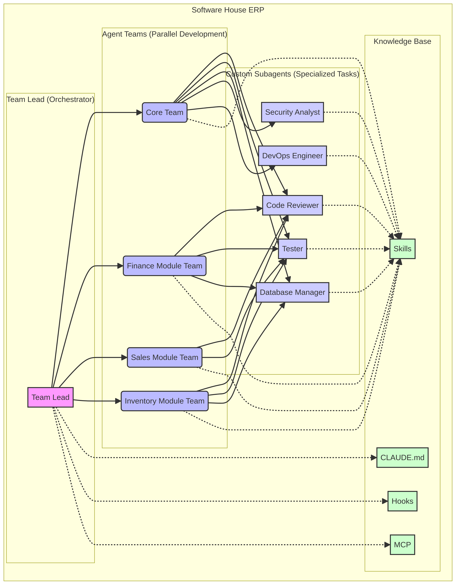

# Software House Completa com Agentes de IA no Claude Code

**Autor:** Manus AI
**Data:** 9 de Fevereiro de 2026
**Versão:** 1.0

---

## 1. Introdução

Este documento apresenta a configuração completa de uma **software house virtual** composta por **16 agentes de IA especializados** para o Claude Code, projetada para desenvolver sistemas ERP enterprise de forma profissional, organizada e escalável. A arquitetura foi desenhada com base na **documentação oficial da Anthropic** [1], nas **melhores práticas de subagentes** [2] e no framework de **47 competências de software house** já mapeado nas skills do projeto [3].

A proposta transforma o Claude Code de uma ferramenta de assistência individual em uma **equipe de desenvolvimento completa**, onde cada agente possui um papel bem definido, ferramentas específicas e instruções detalhadas que garantem consistência e qualidade em todo o ciclo de desenvolvimento.

---

## 2. Arquitetura Geral

A arquitetura é organizada em **três camadas hierárquicas** que refletem a estrutura de uma empresa de desenvolvimento de software real. A camada superior é o **Orquestrador** (Tech Lead), que coordena o trabalho de todos os outros agentes. A camada intermediária são os **Especialistas de Domínio** (Architect, Backend, Frontend, etc.), que executam o trabalho técnico. A camada inferior é a **Base de Conhecimento** (CLAUDE.md, Skills, Hooks, MCP), que fornece contexto e regras para todos os agentes.



A tabela a seguir resume a diferença fundamental entre as duas modalidades de colaboração disponíveis no Claude Code, conforme a documentação oficial da Anthropic [1] [4]:

| Característica | Subagents | Agent Teams |
|---|---|---|
| **Contexto** | Janela própria; resultados retornam ao chamador | Janela própria; totalmente independente |
| **Comunicação** | Reportam apenas ao agente principal | Teammates comunicam-se diretamente entre si |
| **Coordenação** | O agente principal gerencia tudo | Task list compartilhada com auto-coordenação |
| **Melhor para** | Tarefas focadas onde apenas o resultado importa | Trabalho complexo que requer discussão e colaboração |
| **Custo de tokens** | Menor | Maior (cada teammate é uma instância separada) |

Para o desenvolvimento do ERP, a recomendação é utilizar **Subagents como padrão** para a maioria das tarefas (revisão de código, testes, migrações de banco), e reservar **Agent Teams** para sprints de desenvolvimento paralelo de múltiplos módulos, onde a comunicação entre agentes é essencial.

---

## 3. Os 16 Agentes da Software House

A equipe completa é composta por 16 agentes especializados, cada um com um papel bem definido, modelo de IA adequado à complexidade da tarefa e conjunto de ferramentas restrito ao necessário. Todos os arquivos de definição seguem o formato oficial de **YAML frontmatter** da Anthropic [2] e estão prontos para uso no diretório `~/.claude/agents/`.

### 3.1 Camada de Orquestração

| Agente | Modelo | Ferramentas | Função Principal |
|---|---|---|---|
| **tech-lead** | opus | Read, Write, Edit, Bash, Grep, Glob | Orquestrador principal. Decompõe features em tarefas, atribui aos agentes especializados, monitora progresso e garante integração. |

O **Tech Lead** é o ponto de entrada para qualquer nova demanda. Ele analisa o pedido, cria um plano de execução, delega tarefas aos agentes especializados na sequência correta e valida o resultado final. A sequência padrão de desenvolvimento que ele segue é: Architect → Database Manager → Backend Developer → Frontend Developer → Tester → Code Reviewer → Security Analyst.

### 3.2 Camada de Design e Arquitetura

| Agente | Modelo | Ferramentas | Função Principal |
|---|---|---|---|
| **architect** | opus | Read, Write, Edit, Bash, Grep, Glob | Projeta a arquitetura de módulos seguindo Clean Architecture e DDD. Define bounded contexts, contratos entre camadas e ADRs. |
| **ux-designer** | sonnet | Read, Write, Edit, Bash | Projeta fluxos de usuário, layouts de telas, design system e padrões de interação para interfaces ERP. |

O **Architect** utiliza o modelo `opus` por lidar com decisões de alto impacto que exigem raciocínio profundo. Ele é responsável por garantir que a direção de dependências da Clean Architecture seja respeitada (Presentation → Application → Domain ← Infrastructure) e que cada módulo de negócio seja um bounded context independente.

O **UX Designer** foca na experiência do operador de ERP, priorizando eficiência operacional com pesquisa atômica, atalhos de teclado e densidade de informação adequada para telas de trabalho intensivo.

### 3.3 Camada de Desenvolvimento

| Agente | Modelo | Ferramentas | Função Principal |
|---|---|---|---|
| **backend-developer** | sonnet | Read, Write, Edit, Bash, Grep, Glob | Implementa APIs RESTful, use cases, lógica de negócio e middleware com Hono e Cloudflare Workers. |
| **frontend-developer** | sonnet | Read, Write, Edit, Bash, Grep, Glob | Cria interfaces com React 18, TypeScript e TailwindCSS. Implementa componentes, state management e formulários. |
| **database-manager** | sonnet | Read, Write, Edit, Bash | Gerencia schemas com Drizzle ORM, cria migrações, otimiza queries e garante integridade referencial. |
| **api-integrator** | sonnet | Read, Write, Edit, Bash, Grep, Glob | Implementa integrações com serviços externos (pagamentos, fiscal, WhatsApp, APIs bancárias). |

Estes quatro agentes formam o núcleo de desenvolvimento. O **Backend Developer** segue estritamente o padrão Controller → Use Case → Repository, garantindo que a lógica de negócio nunca vaze para os controllers. O **Frontend Developer** utiliza React Query para estado de servidor e Zustand para estado global, com tipagem TypeScript estrita (nunca `any`). O **Database Manager** garante multi-tenancy com `tenant_id` em todas as tabelas e auditoria completa com campos `created_at`, `updated_at`, `created_by` e `updated_by`. O **API Integrator** encapsula toda integração externa em Adapters que implementam interfaces do Domain Layer, garantindo que o provedor externo pode ser trocado sem alterar a lógica de negócio.

### 3.4 Camada de Qualidade e Segurança

| Agente | Modelo | Ferramentas | Função Principal |
|---|---|---|---|
| **code-reviewer** | opus | Read, Grep, Glob, Bash | Revisa código para qualidade, performance, segurança e aderência aos padrões. Classifica feedback em Crítico, Recomendação e Nitpick. |
| **tester** | sonnet | Read, Write, Edit, Bash | Cria e executa testes unitários (Vitest), de integração e E2E (Playwright). Garante cobertura mínima de 80%. |
| **security-analyst** | opus | Read, Grep, Glob, Bash | Realiza análise SAST, valida autorização/autenticação, verifica OWASP Top 10 e conformidade LGPD. |
| **debugger** | sonnet | Read, Edit, Bash, Grep, Glob | Identifica causa raiz de bugs através de análise de stack traces, logs e bisect. Implementa correção mínima com teste de regressão. |

O **Code Reviewer** e o **Security Analyst** utilizam o modelo `opus` porque suas análises exigem raciocínio profundo e atenção a detalhes sutis. O Code Reviewer organiza seu feedback em três categorias de severidade, enquanto o Security Analyst classifica vulnerabilidades de Crítica a Baixa seguindo o padrão OWASP. O **Tester** segue a pirâmide de testes (unitários > integração > E2E) com o padrão AAA (Arrange-Act-Assert). O **Debugger** foca sempre na causa raiz, nunca nos sintomas, e toda correção é acompanhada de um teste de regressão.

### 3.5 Camada de Operações e Suporte

| Agente | Modelo | Ferramentas | Função Principal |
|---|---|---|---|
| **devops-engineer** | sonnet | Read, Write, Edit, Bash | Gerencia pipelines GitHub Actions, deploy via Wrangler, infraestrutura Cloudflare e monitoramento. |
| **performance-optimizer** | sonnet | Read, Edit, Bash, Grep, Glob | Analisa e otimiza performance em todas as camadas (API, banco, frontend, rede). |
| **doc-writer** | sonnet | Read, Write, Edit, Bash, Grep, Glob | Cria documentação de API (OpenAPI), guias de usuário, ADRs, READMEs e changelogs. |
| **git-manager** | haiku | Read, Write, Edit, Bash, Grep, Glob | Gerencia branches, commits semânticos, PRs estruturados e releases. |
| **refactoring-specialist** | opus | Read, Write, Edit, Bash, Grep, Glob | Transforma código legado em Clean Architecture usando Strangler Fig Pattern e refatorações incrementais. |

O **Git Manager** utiliza o modelo `haiku` (rápido e de baixo custo) porque suas tarefas são operacionais e bem definidas. O **Refactoring Specialist** utiliza `opus` porque a refatoração de código legado exige compreensão profunda do sistema e planejamento cuidadoso para manter o sistema funcional a cada passo.

---

## 4. Estrutura de Arquivos

A configuração completa da software house está organizada na seguinte estrutura de diretórios:

```
~/.claude/
├── CLAUDE.md                          # Configuração global (regras, workflows, convenções)
├── agents/
│   ├── tech-lead.md                   # Orquestrador principal
│   ├── architect.md                   # Arquiteto de soluções
│   ├── ux-designer.md                 # Designer UX/UI
│   ├── backend-developer.md           # Desenvolvedor backend
│   ├── frontend-developer.md          # Desenvolvedor frontend
│   ├── database-manager.md            # DBA / Gestor de banco de dados
│   ├── api-integrator.md              # Especialista em integrações
│   ├── code-reviewer.md               # Revisor de código
│   ├── tester.md                      # Engenheiro de QA
│   ├── security-analyst.md            # Analista de segurança
│   ├── debugger.md                    # Especialista em debugging
│   ├── devops-engineer.md             # Engenheiro DevOps
│   ├── performance-optimizer.md       # Otimizador de performance
│   ├── doc-writer.md                  # Redator técnico
│   ├── git-manager.md                 # Gestor de Git e PRs
│   └── refactoring-specialist.md      # Especialista em refatoração
└── skills/                            # Skills de conhecimento (ERP, patterns, etc.)
```

Todos os agentes foram criados no escopo **user-level** (`~/.claude/agents/`), o que significa que estão disponíveis em **todos os projetos** do seu ambiente. Para agentes específicos de um projeto, mova-os para `.claude/agents/` na raiz do repositório.

---

## 5. Como Utilizar

### 5.1 Delegação Automática

O Claude Code delega automaticamente tarefas para subagentes quando identifica que a tarefa se encaixa na descrição de um agente. Por exemplo, ao pedir "revise o código do último commit", o Claude automaticamente invocará o agente `code-reviewer` [2].

### 5.2 Invocação Explícita

Você pode invocar um agente específico mencionando-o diretamente na sua instrução:

```
Use o agente architect para projetar o módulo de Contas a Receber
```

```
Use o agente tech-lead para planejar a sprint de desenvolvimento do módulo financeiro
```

### 5.3 Gestão de Agentes

Para visualizar, editar ou criar novos agentes, use o comando `/agents` dentro do Claude Code [2]:

```
/agents
```

Este comando abre uma interface interativa onde você pode ver todos os agentes disponíveis (built-in, user, project e plugin), criar novos agentes, editar configurações existentes e verificar quais agentes estão ativos.

### 5.4 Workflow Recomendado para Nova Feature

A sequência recomendada para desenvolver uma nova feature completa é:

| Passo | Agente | Ação |
|---|---|---|
| 1 | **tech-lead** | Recebe a demanda, decompõe em tarefas e cria o plano de execução |
| 2 | **architect** | Projeta o domínio (entidades, value objects, use cases) e define os contratos |
| 3 | **ux-designer** | Projeta os fluxos de usuário e os layouts das telas |
| 4 | **database-manager** | Cria o schema e gera as migrações com Drizzle |
| 5 | **backend-developer** | Implementa as APIs, use cases e lógica de negócio |
| 6 | **frontend-developer** | Implementa as telas e componentes React |
| 7 | **tester** | Cria testes unitários, de integração e E2E |
| 8 | **code-reviewer** | Revisa todo o código produzido |
| 9 | **security-analyst** | Audita segurança dos endpoints e dados sensíveis |
| 10 | **git-manager** | Cria o PR estruturado com Conventional Commits |
| 11 | **doc-writer** | Atualiza a documentação de API e guias de usuário |
| 12 | **devops-engineer** | Configura o deploy e monitora a release |

### 5.5 Uso com Agent Teams (Desenvolvimento Paralelo)

Para sprints de desenvolvimento paralelo de múltiplos módulos, ative o Agent Teams no `settings.json`:

```json
{
  "experiments": {
    "agentTeams": true
  }
}
```

Com Agent Teams ativado, o Tech Lead pode criar teammates que trabalham em paralelo em módulos diferentes, comunicando-se entre si via mailbox para resolver dependências e conflitos [4].

---

## 6. Cobertura de Competências

A tabela a seguir demonstra como os 16 agentes cobrem as **47 competências** mapeadas no framework de software house [3]:

| Área de Competência | Competências Cobertas | Agentes Responsáveis |
|---|---|---|
| **Gestão e Liderança** | Visão Estratégica, Gestão de Projetos, Comunicação, Liderança Técnica | tech-lead |
| **Arquitetura** | Arquitetura de Software, Design de APIs, Padrões de Design | architect |
| **Backend** | Backend Dev, APIs, Integração de Sistemas, Performance | backend-developer, api-integrator |
| **Frontend** | Frontend Dev, UI/UX, CSS, State Management, Acessibilidade | frontend-developer, ux-designer |
| **Banco de Dados** | Design de BD, Performance, Administration, Backup | database-manager |
| **Qualidade** | QA Manual, Testes Automatizados, Performance, Segurança | tester, code-reviewer |
| **Segurança** | AppSec, Compliance LGPD, Auditoria, Vulnerabilidades | security-analyst |
| **DevOps** | CI/CD, IaC, Cloud, Infraestrutura, Monitoramento | devops-engineer |
| **Documentação** | Documentação Técnica, Guias de Usuário, ADRs, Changelogs | doc-writer |
| **Manutenção** | Debugging, Refatoração, Performance, Tech Debt | debugger, refactoring-specialist, performance-optimizer |
| **Versionamento** | Git, Branches, PRs, Releases, Conventional Commits | git-manager |

---

## 7. Configuração do CLAUDE.md

O arquivo `~/.claude/CLAUDE.md` define as regras globais que todos os agentes seguem. Ele inclui os princípios de Clean Architecture e DDD, o workflow padrão de desenvolvimento (Explore → Plan → Implement → Commit), as convenções de código e ferramentas, e as referências às skills de conhecimento do projeto.

> **Dica da documentação oficial:** "Trate o CLAUDE.md como se estivesse escrevendo instruções para um novo membro da equipe. Inclua as convenções do projeto, os comandos importantes e os padrões que devem ser seguidos." [1]

---

## 8. Próximos Passos

Com a software house de agentes configurada, os próximos passos recomendados são:

1. **Copiar os arquivos para o seu ambiente:** Transfira o diretório `~/.claude/` com todos os agentes para a sua máquina local onde o Claude Code está instalado.

2. **Personalizar para o seu projeto:** Ajuste as instruções dos agentes para refletir as tecnologias e convenções específicas do seu ERP (nomes de módulos, estrutura de pastas, etc.).

3. **Configurar o CLAUDE.md do projeto:** Crie um `CLAUDE.md` na raiz do repositório do ERP com as regras específicas do projeto (estrutura de pastas, comandos de build/test/deploy, etc.).

4. **Testar com uma feature simples:** Comece invocando o `tech-lead` para uma feature pequena e valide que o fluxo de delegação entre agentes funciona corretamente.

5. **Iterar e refinar:** Com base na experiência de uso, ajuste as instruções dos agentes para melhorar a qualidade e a eficiência do desenvolvimento.

---

## Referências

[1]: https://code.claude.com/docs/en/best-practices "Best Practices for Claude Code - Claude Code Docs"
[2]: https://code.claude.com/docs/en/sub-agents "Create custom subagents - Claude Code Docs"
[3]: Skill `softwarehouse-competencies-master` - Framework de 47 competências para software house
[4]: https://addyosmani.com/blog/claude-code-agent-teams/ "Claude Code Swarms - Addy Osmani"
